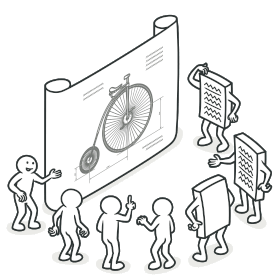

## A Common Problem
Most students taking ICS courses go into the program not know much about coding and have a deeper understanding of computers.  This statement for me is a very real position that I was in when first switching to a CS major.  I had known nothing about coding, how it works, or what it does, but my pure curiosity drove me to work hard to get a better understanding of this technical, sometimes head scratching world of computers.  With out the help of professors, and their many lectures, assignments and quizzes I would not be where I am today.  It seems that I have come across many different design pattern problems to solve during my journey of being a CS major.  

## Building Skills
One major stepping stone for me and a big design pattern problem I can recall was my ICS 212 project.  For this project, we needed to create a banking database through unix.  Users could input their name and register for an account on the bank database, input an amount of money they would like to store, and have it saved into the computer once its done for later accessing.  The whole class knew what we had to do, use a linked list to store informations, where each link with connect one bank user to another.  There was our blueprint, all of the lectures leading up to this projec were teaching us the fundamentals of a linked list and how it works properly.  Each persons code in the class was a little different from the rest, this is where our designing and thought process came into play.  

## Learn, then Execute
Design Patterns are essential for not only learning but executing your ideas and knowledge in the real world.  You need to adjust your design patterns based on the situation because although they are considered "typical solutions to common subproblems," a design pattern is not a block of code or pseudocode, but instead an idea or thought process
