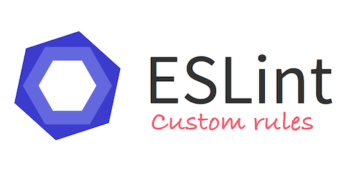

## What are Coding Standards?

The online definition for Coding Standards are defined as being a "set of guidlines, best practices, programming styles and 
conventions that developers adhere to when writing source code for a project" according to CodeAhoy.com.  This week the class
learned about ESLint which is essentially a coding standard enforcer.  By implementing the ESLint rules; when building our 
repositories, the code written had to follow the custom rules for the assignment, where if we did not follow the coding 
standards, the green check mark would not show up on intellij, resulting in code that may be working, but not "correct."

## My Personal Experience
At first I did not understand why we needed to use ESLint and what its actual purpose was.  I also quickly learned that getting
the green checkmark on the top right of my intellij screen was no easy task.  This is because I hadn't set up the javascript 
coding standards correctly.  It can seem like a very tedious task to go into preferences and check on and off certain settings,
but by doing this, I was able to get the green checkmark on all of my javascript source code.  Coding Standards are very 
important in order to maintain consistency in source code.  Although it may have not appeared very crucial in these WOD's and 
homeworks, if you were to be working on a big project in the work force, the coding standards will play a big role in finding
errors and to maintain consistency between different people who are writing source code for one project.

## Using Intellij and ESLint in the Future?
All in all, using ESLint with Intellij was a very tedious but importantant topic for me as a programmer.  Although I may not 
have the need to use it now, I could definitely use this in the future.  With the little experience using Intellij and ESLint
throughout this week, it is definitely better than not having any knowledge on the function and usage of these programs/tools. 
I found the function of Intellij being able to directly communicate with the online GitHub database very interesting and I hope
to use these programs in the future!
