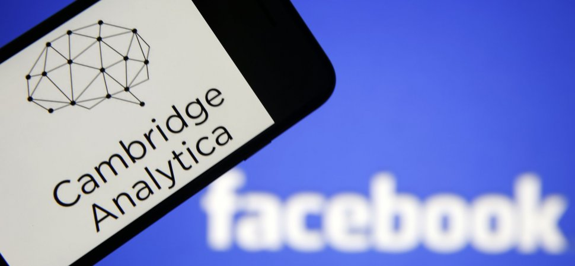

## What is Ethics?
What I consider to be ethics, is somebodies moral compass, doing the right thing to be the best you.  The internet defines 
ethics as "moral principles that govern a person's behavior or the conducting of an activity."  This of couse is related people
but how can it relate to software and tech giants such as Google or Facebook.  There are guidlines to follow when using these 
sites for users, but who is controlling the people behind the application?....

## Invasion of Privacy
In 2017-2018 it was found that recently elected President Trump had worked with Russian Hackers to win the presidential election.
These actions were made possible by these hackers by scraping private emails, information, and data in order to unleash propaganda
on these social media sites like facebook.  The problem here is facebook had known of this problem, yet they didn't alert governement 
officials and kept it under the rug, hidden, hoping the public would either not find out, or that it would ake the situation better.
What these hackers did was deploy these advertisements and propaganda to users that "fit the bill" who they could sway their 
personal opinions and vote for Trump.  I to remember seeing these videos of "Crooked Hillary" on my timeline here and there.  
The issue however lies much deeper than a presidential race.

## Are they always Listening...
I have done many tests, either for fun or for a school essay and have found out that yes indeed, these websites are listening.  If you 
have a conversation with a friend about something, it could be anything, like a watch, the next day advertisements for watches
show up on google advertisements, facebook ads, and much more.  When I shop on sites like Pacsun in the morning, by afternoon, while 
scrolling on Facebook, I see ads from clothing brands like Pacsun, American Eagle and others.  I have come to the conclusion that
yes, while these tech companies may be listening to our recent searches and conversations, they are using it to deploy advertisements
as a marketing strategy.  It is of couse a little scary, but it happens to all of us behind the scenes.  

This Breaks the ACM Code of Ethics and Professional Conduct where section 1.6 respect privacy explains "Only the minimum amount of personal information necessary should be collected in a system."
While you can't control what the internet saves of you, you should always be wary of the information you put online for your own 
privacy.  
